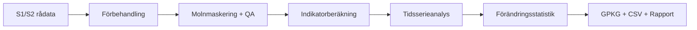

# Naturvårdsverket – VåtmarkWatch

- **Beställare:** Naturvårdsverket
- **Status:** Ramavtal (dummy)
- **Länk:** [Mercell][1]
- **Omfattning:** Nationell våtmarksmonitering
- **Tidsram:** 2025–2028 (ramavtal)

---

## Sammanfattning

**VåtmarkWatch** är ett dummy-projekt för Sentinel-baserad säsongsmonitorering och förändringsanalys av våtmarker på AOI-nivå. Lösningen kombinerar SAR (S1) och optiska (S2) tidsserier för att identifiera hydrologiska förändringar, vegetationstrender och eventuella restaureringseffekter.

Projektet demonstrerar:

- Reproducerbar pipeline från rådata till indikatorer
- Kvalitetssäkring enligt HMK
- Leverans av både rumslig data (GPKG) och sammanställningstabeller (CSV)

---

## Metod i detalj

### 1. Indata

| Datakälla | Upplösning | Användning |
|-----------|-----------|------------|
| Sentinel-1 (GRD, VV/VH) | 10 m | Backscatter-trender (vattenyta, fukt) |
| Sentinel-2 (L2A) | 10 m | NDWI, NDMI, säsongsindex |
| Referensytor (fält/orto) | Varierar | Validering, träningsdata |
| Marktäckedata (NMD/CLC) | 10–25 m | Kontextanalys, stratifiering |

### 2. Analysflöde



**Steg:**

1. **Förbehandling:** Resampling, radiometrisk kalibrering (S1), molnmaskering (S2)
2. **Indikatorberäkning:**
   - **NDWI** = (Green − NIR) / (Green + NIR) → vattenyta
   - **NDMI** = (NIR − SWIR1) / (NIR + SWIR1) → fuktnivå
   - **VV-backscatter:** S1 → vattenyta (låg backscatter)
3. **Tidsserieanalys:** Medelvärde/median per månad, trendanalys (Mann-Kendall), säsongsindex
4. **Förändringsdetektion:** Jämförelse mellan basår och aktuellt år, t-test, breakpoint-analys

### 3. Kvalitetssäkring (QA/QC)

- **Molnmaskering:** S2 Scene Classification Layer (SCL), visuell kontroll
- **Validering:** Jämförelse mot fältreferensytor (n=20–30 per region)
- **Metadatafält (HMK):**
  - `kvalitet_nivå` (1–3)
  - `datakälla` (t.ex. "S1_GRD_VV_VH", "S2_L2A")
  - `datum_insamling` (ISO 8601)
  - `metod` (t.ex. "NDWI_tidsserie_Mann-Kendall")
  - `granskare` (initials)

### 4. Exempelresultat

**Tabell: Förändringsstatistik för tre AOI (dummy-data)**

| AOI_ID | Namn | Area (ha) | NDWI_trend (2020–2024) | VV_median_förändring (dB) | Status |
|--------|------|-----------|------------------------|---------------------------|--------|
| AOI_001 | Tåkern NR | 350 | +0.02/år (p<0.05) | −1.2 | Fuktigare |
| AOI_002 | Hornborgasjön | 480 | +0.01/år (ns) | −0.5 | Stabil |
| AOI_003 | Annsjon | 120 | −0.03/år (p<0.01) | +2.1 | Torrare |

**Figur: Exempel-kartplacering (dummy)**

```
[ Karta 1: NDWI-förändring 2020–2024, AOI_001 ]
→ Skulle länka till: outputs/aoi_001_ndwi_change_map.png
```

---

## Leverabler

### Rumslig data (GPKG)

- **Lager:** `aoi_vatmarker`, `forändring_polygoner`
- **Attribut:** ID, namn, area, trendvärden (NDWI, VV), p-värde, status

### Tabeller (CSV)

- `aoi_summary.csv`: Sammanfattning per AOI
- `timeseries_monthly.csv`: Månadsvärden (NDWI, NDMI, VV) för varje AOI

### Rapport (MkDocs/PDF)

- Metodik, resultat, kartbilagor, validering, slutsatser

### Metadata

- HMK-fält i GPKG, XML-metadata enligt ISO 19115

---

## Kontakt & återanvändning

Detta dummy-projekt demonstrerar en standardiserad pipeline för våtmarksmonitering. Metoden är anpassningsbar för:

- Regional/nationell övervakning
- Restaureringsuppföljning
- MKB-underlag (hydrologiska förändringar)

[1]: https://www.mercell.com/sv-se/upphandling/240088984/upphandling-av-ramavtal-gallande-konsultstod-for-overvakning-av-vaatmarker-upphandling.aspx

