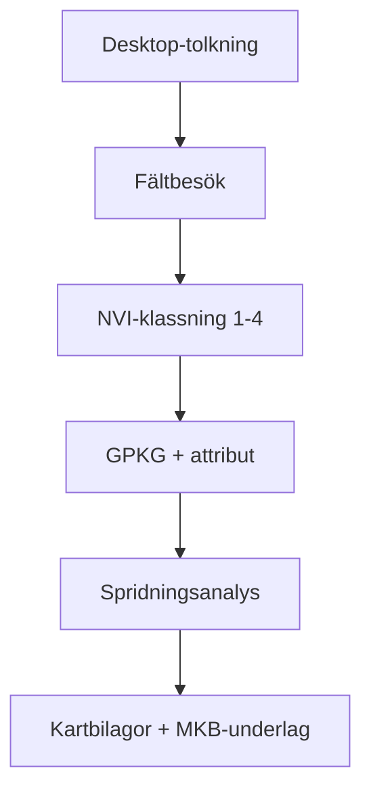

# Ulricehamn – KommunNVI-Suite

- **Beställare:** Ulricehamns kommun m.fl.
- **Status:** Ramavtal (dummy)
- **Länk:** [Mercell][1]
- **Omfattning:** NVI + spridningsanalys + MKB-underlag
- **Tidsram:** 2025–2028 (ramavtal)

---

## Sammanfattning

**KommunNVI-Suite** är ett dummy-projekt som paketerar naturvärdesinventering (NVI), spridningsanalys (least-cost/graph-theory) och MKB-underlag i ett standardiserat leveranspaket. Lösningen riktar sig till kommuner som behöver både basinventering och ekologiska konnektivitetsanalyser för detaljplaner, infrastruktur och grön infrastrukturplanering.

Projektet demonstrerar:

- Komplett NVI-flöde enligt SIS-standard
- Reproducerbar spridningsanalys (Python/R, QGIS/GRASS)
- HMK-kompatibla leverabler för direkt användning i MKB-processer

---

## Metod i detalj

### 1. Indata

| Datakälla | Upplösning | Användning |
|-----------|-----------|------------|
| Ortofoto (Lantmäteriet) | 0.25 m | Fototolkning, NVI-klassning |
| NNH (Nationell naturtypskartering) | Polygon | Naturtypsunderlag |
| Fastighetskartan | Varierar | Plangränser, exploateringsytor |
| Marktäckedata (NMD) | 10 m | Markanvändning, spridningsanalys |
| Skyddade områden (NV) | Polygon | Natura 2000, NR, NP, biotopskydd |
| Artportalen (SLU) | Punkt | Rödlistade/skyddade arter (5 år) |

### 2. Analysflöde



**Steg:**

#### 2.1 Naturvärdesinventering (NVI)

1. **Desktop-tolkning:** Föridentifiering av objekt (orto + NNH + befintliga underlag)
2. **Fältbesök:** Vegetationstyp, struktur, arter, störning (SWEREF99 TM, cm-noggrannhet)
3. **Klassning:** Enligt SIS-standard (SS 199000:2014 Naturvärdesinventering avseende biologisk mångfald, NVI)
   - **Klass 1 (Mycket högt naturvärde):** Hotade arter, nyckelbiotoper, högt skyddsvärde
   - **Klass 2 (Högt naturvärde):** Hög artrikedom, god ekologisk funktion
   - **Klass 3 (Påtagligt naturvärde):** Lokalt viktig, viss artrikedom
   - **Klass 4 (Visst naturvärde):** Begränsad artrikedom, viss potential

4. **Digitalisering:** GPKG, attribut enligt HMK-NVI

#### 2.2 Spridningsanalys (ekologisk konnektivitet)

**Metod: Least-cost path + Graph-theory**

- **Resistansyta:** Raster (10 m) baserat på:
  - Marktäcke (skog = 1, åker = 5, bebyggelse = 100)
  - Avstånd till skyddade områden (låg resistans nära NR/N2000)
  - Barriärer (vägar, järnväg: högre resistans)
  
- **Källytor (source patches):** NVI klass 1–2, skyddade områden
- **Målyta (destination):** Exploateringsområde

**Verktyg:** GRASS GIS (`r.cost`, `r.drain`), NetworkX (Python), eventuellt Circuitscape för flervägsanalys

**Output:**

- Least-cost paths (vektorlinjer)
- Kostnadsdistans-raster
- Graph-noder och edges (centrality-mått för prioritering av korridorer)

### 3. Kvalitetssäkring (QA/QC)

- **Fältmetodik:** HMK-NVI (standardformulär, foto-ID)
- **Granskning:** Intern kontroll (senior ekolog)
- **Metadatafält (exempel):**

| Fält | Beskrivning | Exempel |
|------|-------------|---------|
| `nvi_klass` | NVI-klassning | 1, 2, 3, 4 |
| `naturtyp` | Naturtyp enligt NNH | "Ädellövskog", "Naturbetesmark" |
| `art_rodlista` | Rödlistade arter (antal) | 2 |
| `datum_falt` | Fältdatum | 2025-06-15 |
| `metod` | Inventeringsmetod | "Fält+Desktop" |
| `granskare` | Granskare | "JD" |

### 4. Exempelresultat

**Tabell: NVI-sammanfattning per klass (dummy-data)**

| NVI-klass | Antal objekt | Total area (ha) | Andel av utredningsområde |
|-----------|--------------|-----------------|---------------------------|
| 1 (Mycket högt) | 3 | 12.5 | 8% |
| 2 (Högt) | 8 | 28.3 | 18% |
| 3 (Påtagligt) | 15 | 45.7 | 29% |
| 4 (Visst) | 22 | 71.2 | 45% |
| **Totalt** | **48** | **157.7** | **100%** |

**Tabell: Spridningsanalys – kritiska korridorer**

| Korridor_ID | Från (source) | Till (destination) | Längd (m) | Genomsnittlig resistans | Prioritet |
|-------------|---------------|---------------------|-----------|-------------------------|-----------|
| C1 | NR_Torsagården | Exploatering_A | 850 | 12.4 | Hög |
| C2 | N2000_Ulricesjön | Exploatering_A | 1200 | 18.7 | Medel |
| C3 | NVI_001 (klass 1) | Exploatering_A | 620 | 9.2 | Mycket hög |

**Figur: Exempel-kartplacering (dummy)**

```
[ Karta 1: NVI-klassning, utredningsområde ]
→ Skulle länka till: outputs/nvi_classification_map.pdf

[ Karta 2: Spridningsanalys – least-cost paths och resistansyta ]
→ Skulle länka till: outputs/connectivity_analysis_map.pdf
```

---

## Leverabler

### 1. Rumslig data (GPKG)

- **Lager:** `nvi_objekt`, `spridningskorridorer`, `resistansyta_10m` (tillval)
- **Attribut:** NVI-klass, naturtyp, arter, datum, granskare, korridor-ID, resistans

### 2. Kartbilagor (PDF)

- Översiktskarta (A3): NVI-klassning, skyddade områden, exploateringsyta
- Detaljkartor (A3): NVI per objekt, foton, artfynd
- Spridningskarta (A3): Korridorer, resistansyta, prioriterade zoner

### 3. MKB-underlag (DOCX/PDF)

- **Naturvärdesbeskrivning:** Text per NVI-klass, ekosystemtjänster
- **Påverkansbedömning:** Exploateringseffekter på NVI-objekt och korridorer
- **Åtgärdsförslag:** Kompensation, skyddsåtgärder, korridorförstärkning

### 4. Metadata (XML)

- ISO 19115, HMK-NVI

### 5. Reproducerbar pipeline (tillval)

- Python/R-skript för spridningsanalys
- QGIS-modell (Processing Toolbox)
- README med körningsanvisning

---

## Standardpaket – exempel på omfattning

| Paket | Omfattning | Leverabler | Pris (indikativt, dummy) |
|-------|-----------|------------|--------------------------|
| **Bas** | NVI desktop + översiktskarta | GPKG, 1 karta (A3), kortrapport | 80 000 SEK |
| **Standard** | NVI fält + spridningsanalys | GPKG, 3 kartor (A3), MKB-underlag | 180 000 SEK |
| **Komplett** | NVI fält + spridning + QA + skript | GPKG, 5 kartor (A3), MKB-underlag, reproducerbar pipeline | 280 000 SEK |

---

## Kontakt & återanvändning

Detta dummy-projekt demonstrerar ett heltäckande NVI- och konnektivitetspaket. Metoden är anpassningsbar för:

- Detaljplaner (bostäder, industri)
- Infrastruktur (vägar, järnväg)
- Grön infrastrukturplanering (regionalt)
- Restaureringsprojekt (prioritering av insatser)

**Teknisk stack:**

- QGIS/GRASS GIS, Python (NetworkX, rasterio), R (gdistance, igraph)
- MkDocs/LaTeX för rapporter

[1]: https://www.mercell.com/sv-se/upphandling/265635005/tekniska-konsulter-inom-nvi-och-mkb-upphandling.aspx

